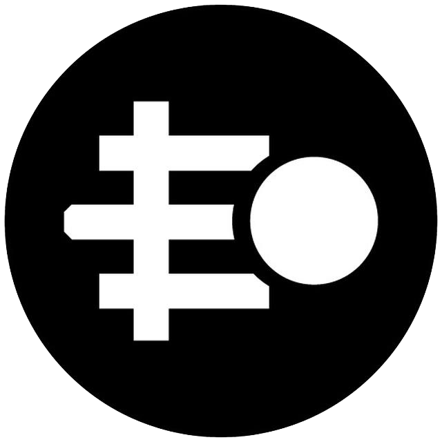

  

  
  

  

    🚀 <strong>ELTCOIN</strong>  🚀
  

  

    A community-driven currency that powers an open-sourced library of cool dapps built on Ethereum.
  

## Projects

- [Eltwallet: Non-custodial decentralized mobile wallet](https://www.github.com/eltcoin/eltwallet)
- [Pocketbook: Censorship immune, decentralized human network](https://www.github.com/eltcoin/pocketbook)

## Submit a new project

[Create a new GitHub issue](https://github.com/ELTCOIN/projects/issues/new) on this repository with details about your project. The community will review and approve your submission.

## Contributing to a project

Developer, designer, project manager or simply want to help one of the projects?

Come say hello in [our Slack workspace](https://join.slack.com/t/eltcoin/shared_invite/enQtNDE5NTY4MzA2OTQ0LWU3MjViNzQyN2VkNTllZTBlMDE5MWQ2ZTllYmM4YmNjMTQwZjRkYzNiMTIzMTBmNjFlODMxYjRkNGMwMzA3NWY), we'll see what's the best way to get you started.

## Rewards

The ELTCOIN team will use [the 10% fund](https://etherscan.io/address/0x59820c019d9eff4152354a575eaddb5b8b2c8dda) to reward contributors on a monthly basis. As more people get involved, we'll work towards building a more structured bounty program similar to what [Gitcoin](https://gitcoin.co/) offers.
